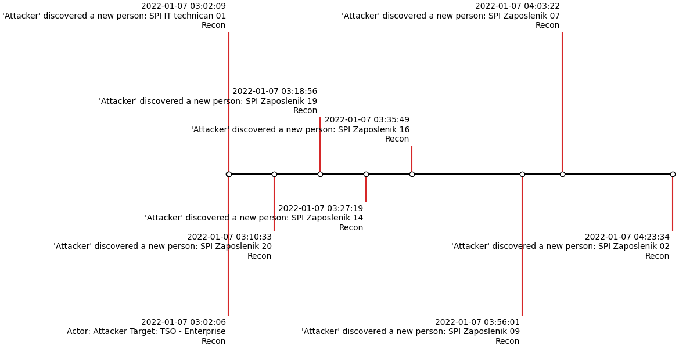

## Install & setup
```
git clone https://github.com/matjuric/diplomski.git

cd rad/uinc
python manage.py makemigrations
python manage.py migrate
```

Creating admin user, login onto adming pages
```
python manage.py createsuperuser
// enter username, password

python manage.py runserver
goto: http://localhost:8000/admin
login with previously created superuser credentials
```

Admin pages setup
```
add new entries in Groups
- "koordinator" with permissions:
  sustav | incident | Can add incident

  sustav | incident | Can change incident

  sustav | incident | Can delete incident

  sustav | incident | Can view incident

- "radnik" with permissions:
  sustav | incident | Can add incident

  sustav | incident | Can change incident

  sustav | incident | Can view incident


- add previously created superuser to "koordinator" group
- create new user "worker" and add him to "radnik" group
```
Ready for work:

```
python manage.py runserver
login with created user credentials(superuser or created "radnik" user)
```

## timeliner.py
- tool for drawing timelines out of formatted *.xlsx files
- input: `*.xlsx` file, path to where you want to create `*.csv` file(created out of `*.xlsx` file)
- output: `PNG` format picture of timeline
- usage:
```
cd rad/
python timeliner.py path_to_xlsx.xlsx path_to_csv.csv
```
### Example

